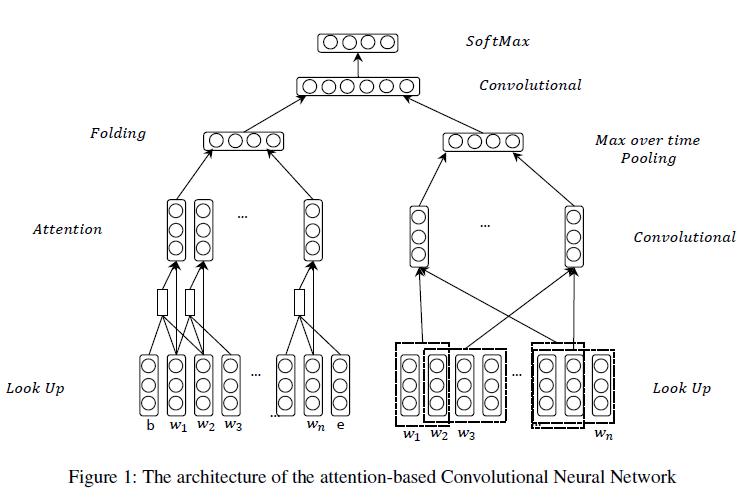

# ABC model

### Proposed in [Hashtag Recommendation Using Attention-Based Convolutional Neural Network](https://www.ijcai.org/Proceedings/16/Papers/395.pdf) IJCAI 2016, by Yuyun Gong et al.

## **Overview**
###  ABC adopts an attentionbased CNN architecture to recommend tags for textual content. It models the text sequential order with both local attention and the global attention.  
### Model Architecture

## **Usage**
### Source files in this repository can not be executed immediately, as there is no data preprocessing and data inputs statements. So you should get your data prepared according to your need.  

## **Requirements**
- Python 3.x
- Tensorflow >= 1.7
- Keras >= 2.1.5

