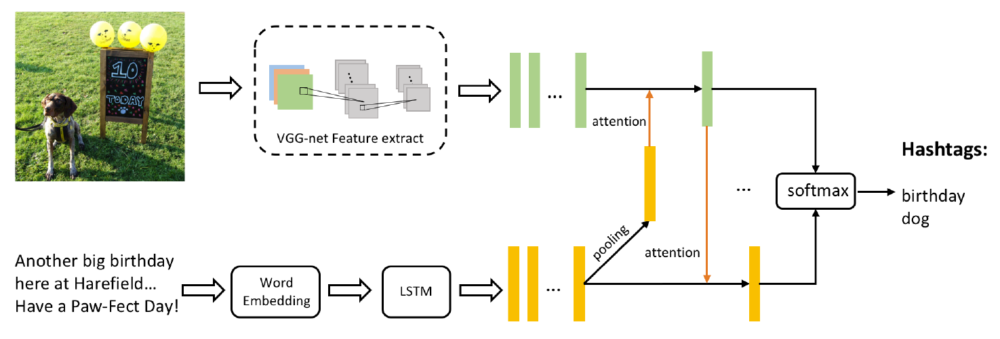

# CoA model

### Proposed in [Hashtag Recommendation for Multimodal Microblog Using Co-Attention Networks](https://www.ijcai.org/proceedings/2017/0478.pdf) IJCAI 2017, by Qi Zhang et al.

## **Overview**
### CoA is can be used to recommend hashtags for multimodal microblogs which are composed of both texual and visual content. The main contribution of CoA lies in an alternative co-attention mechanism to extract post features.  
### Model Architecture

## **Usage**
### Source files in this repository can not be executed immediately, as there is no data preprocessing and data inputs statements. So you should get your data prepared according to your need.  

## **Requirements**
- Python 3.x
- Tensorflow >= 1.7
- Keras >= 2.1.5

