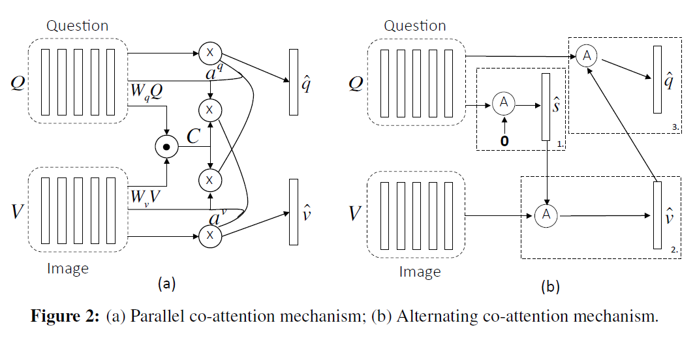

# Hierarchical Co-Attention VQA

Proposed in [Hierarchical Question-Image Co-Attention for Visual Question Answering](http://papers.nips.cc/paper/6202-hierarchical-question-image-co-attention-for-visual-question-answering.pdf) NIPS 2016, by Jiasen Lu et al.

## **Overview**
###  Two kinds of co-attention mechanisms are proposedin this article. Basic idea of co-attention mechanism is that for certain target, the importance of subparts in text and image vary so they should be treated differently. Moreover, question text and image are usually semantically related and one can be used to understand the other. So they resort to co-attention mechanism and propose co-attention in alternative way and parallel way.  
### Model Architecture

## **Usage**
### Source files in this repository can not be executed immediately, as there is no data preprocessing and data inputs statements. So you should get your data prepared according to your need.  

## **Requirements**
- Python 3.x
- Tensorflow >= 1.7
- Keras >= 2.1.5

