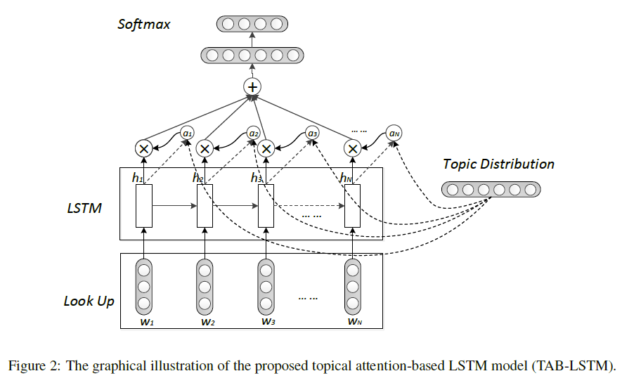

# TAB-LSTM model

### Proposed in [Hashtag recommendation with topical attention-based LSTM](http://www.aclweb.org/anthology/C16-1284) COLING 2016, by Yang Li et al.

## **Overview**
### TAB-LSTM is used to recommend hashtags for texual content. it employs LSTM to extract textual features and integrates an attention mechanism by pre-trained topical distributions.

### Model Architecture

## **Usage**
### Source files in this repository can not be executed immediately, as there is no data preprocessing and data inputs statements. So you should get your data prepared according to your need.  

### Topical distribution can be pre-trained with LDA model.

## **Requirements**
- Python 3.x
- Tensorflow >= 1.7
- Keras >= 2.1.5

